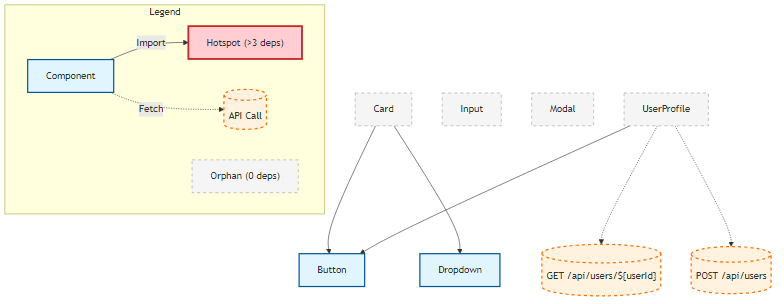

### Back-end file structure

```bash
services/
├── cli/
│   ├── index.ts                    # Main CLI entry point
│   ├── commands/
│   │   ├── scan.ts                # Scan command
│   │   ├── watch.ts               # Watch mode command  
│   │   ├── analyze.ts             # Dependency analysis command
│   │   └── generate.ts            # Generate manifest command
│   └── config.ts                  # CLI config loader
│
├── core/
│   ├── scanner.ts                 # ✅ File discovery (needs bug fixes)
│   ├── patterns.ts                # ✅ Framework patterns
│   ├── parser.ts                  # NEW: Unified parser interface
│   ├── parsers/
│   │   ├── react-parser.ts       # Refactored from jumbo-parser
│   │   ├── vue-parser.ts         # Future
│   │   └── svelte-parser.ts      # Future
│   ├── dependency-graph.ts        # Refactored from dependency-mapper
│   ├── watcher_temp.ts                 # Refactored from watch-parser
│   └── cache.ts                   # NEW: Parse result caching
│
├── services/
│   ├── manifest-generator.ts      # Generate output manifest
│   ├── impact-analyzer.ts         # "What breaks if I change X?"
│   └── relationship-mapper.ts     # Component-to-hook relationships
│
├── utils/
│   ├── ignore.ts                  # ⚠️ Needs bug fix
│   ├── output.ts                  # JSON formatting
│   ├── logger.ts                  # Structured logging
│   └── file-hash.ts               # For caching
│
├── types/
│   ├── index.ts                   # ✅ Core types
│   ├── parser.ts                  # Parser-specific types
│   ├── graph.ts                   # Dependency graph types
│   └── manifest.ts                # Output manifest schema
│
├── test/
│   ├── unit/
│   │   ├── scanner.test.ts
│   │   ├── parser.test.ts
│   │   ├── dependency-mapper.test.ts  # ✅ Already exists
│   │   └── graph-builder.test.ts
│   ├── integration/
│   │   ├── full-scan.test.ts
│   │   └── watch-mode.test.ts
│   └── fixtures/                   # ✅ Already have good test components
│       ├── Button.tsx
│       ├── Card.tsx
│       └── ...
│
└── output/
    ├── library-metadata.json       # Generated manifest
    └── dependency-graph.json       # Generated graph
```


### CLI core:
```bash
{
  "dependencies": {
    "commander": "^11.1.0",
    "enquirer": "^2.4.1",
    "chalk": "^5.3.0",
    "ora": "^8.0.1"
  }
}
```

### File scanning
```bash
{
  "dependencies": {
    "fast-glob": "^3.3.2",      // Faster than globby, better for large projects
    "ignore": "^5.3.0",         // Respect .gitignore
    "chokidar": "^3.5.3"        // File watching (for future dev mode)
  }
}
```
### Mermaid Visual




### Quick Tutorial, 
for what we developed so far...

#### 1. **`scan`** - Find Components
```bash
patternbook scan ./test/fixtures
```
**What it does:**
- Scans directory for component files (`.tsx`, `.jsx`, `.vue`, `.svelte`)
- Parses each component to extract metadata (name, props, hooks)
- Saves results to JSON file (default: `scan-results.json`)

**Use case:** Quick inventory of what components exist in your project

---

#### 2. **`generate`** - Create Full Manifest
```bash
patternbook generate ./test/fixtures --output manifest.json
```
**What it does:**
- Scans + parses all components (like `scan`)
- Builds dependency graph (what imports what)
- Creates complete manifest with:
  - Component metadata
  - Props & types
  - Hooks usage
  - Tags (auto-generated)
  - Dependency relationships
- Outputs comprehensive JSON for your frontend to consume

**Use case:** Generate the production manifest file that powers your PatternBook UI

---

#### 3. **`analyze`** - Dependency Analysis
```bash
patternbook analyze ./test/fixtures --target Button
```
**What it does:**
- Scans + parses all components
- Builds full dependency graph
- **Impact analysis** - answers "What breaks if I change X?"
  - Shows direct dependents (what imports this)
  - Shows indirect dependents (what imports those)
  - Calculates risk level (low/medium/high)
- Can export as JSON or Mermaid diagram

**Use case:** Before refactoring a component, see what else will be affected

---

#### 4. **`watch`** - Live Development Mode
```bash
patternbook watch ./test/fixtures
```
**What it does:**
- Monitors directory for file changes
- Auto-re-parses when you save a file
- Updates metadata in real-time
- Continuously saves to `library-metadata.json`
- Shows impact analysis on changes

**Use case:** Keep your component manifest up-to-date during development

---

#### Quick Comparison

| Command | Speed | Output | Use When |
|---------|-------|--------|----------|
| `scan` | ⚡ Fast | Simple list | "What components do I have?" |
| `generate` | 🐌 Slow | Full manifest | "Build production manifest" |
| `analyze` | 🐌 Slow | Graph + impact | "What depends on this?" |
| `watch` | ♻️ Continuous | Live updates | "Keep manifest fresh" |

---

#### 💡 Typical Workflow

```bash
# 1. First time setup - generate full manifest
patternbook generate ./src/components --output public/manifest.json

# 2. During development - watch for changes
patternbook watch ./src/components

# 3. Before refactoring - check impact
patternbook analyze ./src/components --target Button.tsx

# 4. Quick check - scan only
patternbook scan ./src/components
```

**Bottom line:** 
- **`scan`** = List components
- **`generate`** = Build full manifest for production
- **`analyze`** = Understand dependencies & impact
- **`watch`** = Keep manifest fresh during dev
