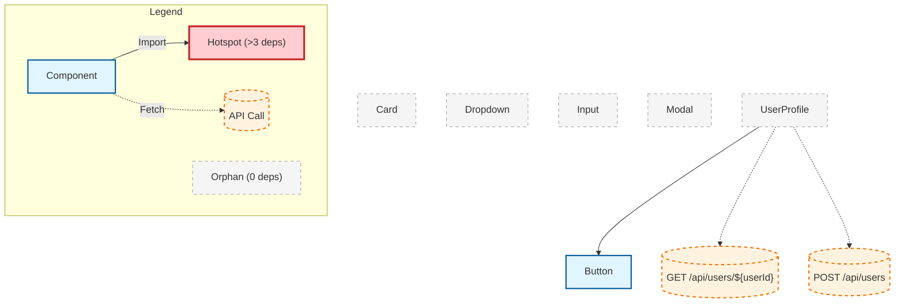
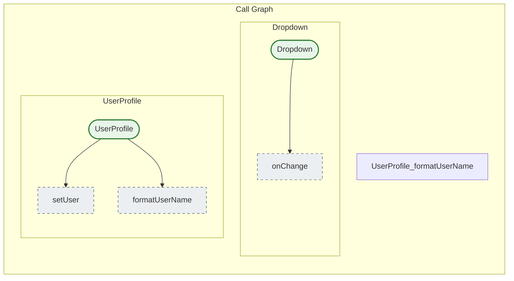

### Back-end file structure

```bash
services/
├── cli/
│   ├── index.ts                    # Main CLI entry point
│   ├── commands/
│   │   ├── scan.ts                # Scan command
│   │   ├── watch.ts               # Watch mode command  
│   │   ├── analyze.ts             # Dependency analysis command
│   │   └── generate.ts            # Generate manifest command
│   └── config.ts                  # CLI config loader
│
├── core/
│   ├── scanner.ts                 # ✅ File discovery (needs bug fixes)
│   ├── patterns.ts                # ✅ Framework patterns
│   ├── parser.ts                  # NEW: Unified parser interface
│   ├── parsers/
│   │   ├── react-parser.ts       # Refactored from jumbo-parser
│   │   ├── vue-parser.ts         # Future
│   │   └── svelte-parser.ts      # Future
│   ├── dependency-graph.ts        # Refactored from dependency-mapper
│   ├── watcher_temp.ts                 # Refactored from watch-parser
│   └── cache.ts                   # NEW: Parse result caching
│
├── services/
│   ├── manifest-generator.ts      # Generate output manifest
│   ├── impact-analyzer.ts         # "What breaks if I change X?"
│   └── relationship-mapper.ts     # Component-to-hook relationships
│
├── utils/
│   ├── ignore.ts                  # ⚠️ Needs bug fix
│   ├── output.ts                  # JSON formatting
│   ├── logger.ts                  # Structured logging
│   └── file-hash.ts               # For caching
│
├── types/
│   ├── index.ts                   # ✅ Core types
│   ├── parser.ts                  # Parser-specific types
│   ├── graph.ts                   # Dependency graph types
│   └── manifest.ts                # Output manifest schema
│
├── test/
│   ├── unit/
│   │   ├── scanner.test.ts
│   │   ├── parser.test.ts
│   │   ├── dependency-mapper.test.ts  # ✅ Already exists
│   │   └── graph-builder.test.ts
│   ├── integration/
│   │   ├── full-scan.test.ts
│   │   └── watch-mode.test.ts
│   └── fixtures/                   # ✅ Already have good test components
│       ├── Button.tsx
│       ├── Card.tsx
│       └── ...
│
└── output/
    ├── library-metadata.json       # Generated manifest
    └── dependency-graph.json       # Generated graph
```


### CLI core:
```bash
{
  "dependencies": {
    "commander": "^11.1.0",
    "enquirer": "^2.4.1",
    "chalk": "^5.3.0",
    "ora": "^8.0.1"
  }
}
```

### File scanning
```bash
{
  "dependencies": {
    "fast-glob": "^3.3.2",      // Faster than globby, better for large projects
    "ignore": "^5.3.0",         // Respect .gitignore
    "chokidar": "^3.5.3"        // File watching (for future dev mode)
  }
}
```
### Mermaid Visuals

<!-- DEPENDENCY_GRAPH-START -->
#### Dependency Graph (Imports & API Calls)


<!-- DEPENDENCY_GRAPH-END -->

<!-- CALL_GRAPH-START -->
#### Call Graph (Function Interactions)


<!-- CALL_GRAPH-END -->

