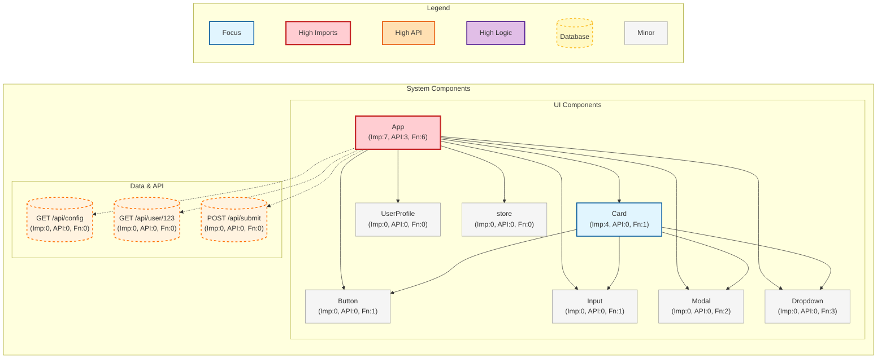
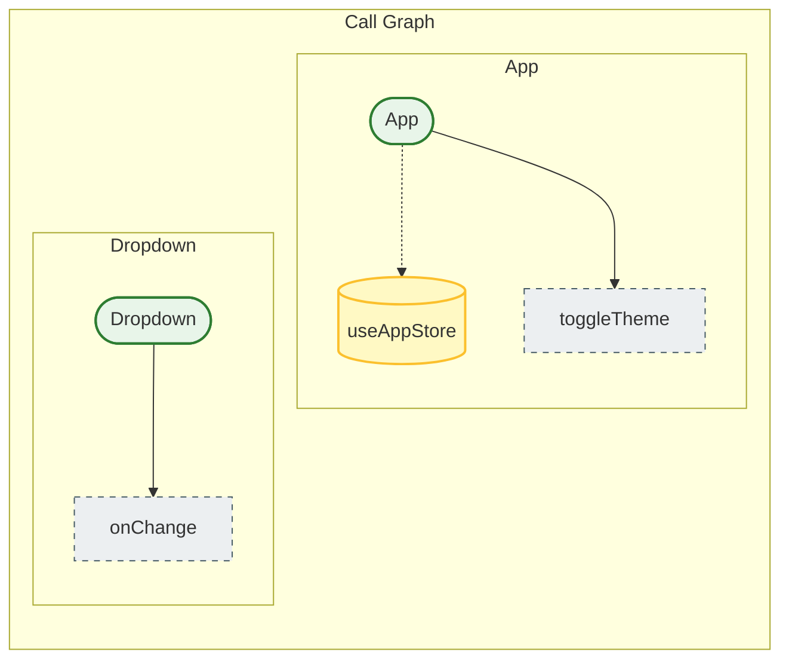

# Test Components

This folder contains sample React components for testing the PatternBook parser.

## Purpose

Use these components to test the ts-morph static analysis engine. The parser should:

1. Scan these `.tsx` files
2. Extract component metadata (props, types, JSDoc comments)
3. Generate a `manifest.json` that matches the schema in `/src/types/manifest.ts`

## Components

- **Button.tsx** - Button with variants and sizes
- **Input.tsx** - Input field with validation
- **Card.tsx** - Container component
- **Modal.tsx** - Modal dialog
- **Dropdown.tsx** - Select dropdown

## For Backend Team

To test the parser, run it against this folder:

```bash
npx patternbook generate --input ./test-components --output ./public/generated-manifest.json
```

The generated manifest should match the structure in `/public/mock-data/manifest.json`.
<<<<<<< HEAD

<!-- DEPENDENCY_GRAPH-START -->

#### Dependency Graph



<!-- DEPENDENCY_GRAPH-END -->

<!-- CALL_GRAPH-START -->

#### Call Graph



<!-- CALL_GRAPH-END -->
=======
>>>>>>> origin/main
